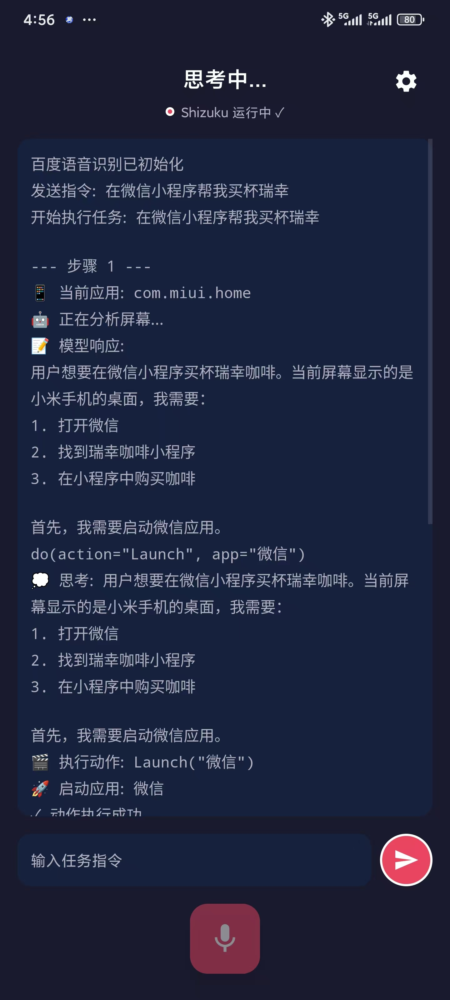

# XiaoZhi AI (小智 AI)

这是一个基于 Android 的智能助手项目，旨在为移动设备提供先进的 AI 能力。
本项目深受 [AutoGLM](https://github.com/zai-org/Open-AutoGLM) 的启发，是其在 Android 端的一种探索与实现。

## 致谢
特别感谢 [AutoGLM](https://github.com/zai-org/Open-AutoGLM) 项目提供的灵感与基础工作。
- Python 项目地址: [https://github.com/zai-org/Open-AutoGLM](https://github.com/zai-org/Open-AutoGLM)

智谱官方其实已经有鸿蒙和 iOS 版本的相关实现了。但由于我手头缺乏这两类设备，暂时只完成了 Android 版本的开发。

目前鸿蒙和 iOS 的底层机制与 Android 略有不同（不支持通用的 ADB 连接），因此实现方式会有所区别。如果论坛里的各位大佬有设备也有兴趣，欢迎一起动手，把这两个平台的坑也填上。

这里我有一些初步的技术构想，供大家参考：

点击查看跨平台实现构想

*   **HarmonyOS (鸿蒙)**
    *   方案：**内网穿透 + HDC**
    *   思路：通过 HDC (HarmonyOS Device Connector) 建立连接，配合内网穿透技术实现远程控制和指令下发。

*   **iOS (苹果)**
    *   方案：**内网穿透 + WebDriverAgent**
    *   思路：利用 Facebook 的 WebDriverAgent 项目 (通常用于 Appium) 在 iOS 设备上运行个 Server，配合内网穿透暴露接口，从而实现点击、滑动和截图等操作。

*   **安卓 **
    *   方案：**内网穿透 + adb**
    *   思路：同理安卓也行，通过内网穿透技术，将安卓设备的 ADB 端口暴露到外网，从而实现远程控制和指令下发。

目前项目还在持续迭代中，欢迎大家试玩、Star 或者提 PR 一起完善。

**项目截图**

## 功能特性
- **智能对话**: 通过自然语言与 AI 助手交互。
- **移动端优化**: 专为 Android 平台设计。

## 目录结构
- `android/`: Android 应用程序源代码。
- `lib-apps/`: 依赖的应用程序。

## 快速开始

### 前置要求
1. **Shizuku (必须)**
    - 本项目依赖 Shizuku 进行系统层面的操作（如模拟点击、截图等）。
    - 下载地址: [https://shizuku.rikka.app/](https://shizuku.rikka.app/)
    - **使用方法**:
        1. 安装 Shizuku app。
        2. 按照 Shizuku app 内的指引启动服务（已 root 设备直接授权，未 root 设备可通过无线调试启动）。
        3. 启动小智 AI 后，请在 Shizuku 中授权给小智 AI。

2. **ADB Keyboard (用于文本输入)**
    - 下载 [安装包](https://github.com/senzhk/ADBKeyBoard/blob/master/ADBKeyboard.apk) 并在对应的安卓设备中进行安装。
    - 注意，安装完成后还需要到 `设置-输入法` 或者 `设置-键盘列表` 中启用 `ADB Keyboard` 才能生效(或使用命令`adb shell ime enable com.android.adbkeyboard/.AdbIME` [How-to-use](https://github.com/senzhk/ADBKeyBoard/blob/master/README.md#how-to-use))

3. **Android Studio**
4. **JDK 17+**

### 编译与运行
1. 使用 Android Studio 打开项目。
2. 同步 Gradle。
3. 在设备或模拟器上运行应用程序。
